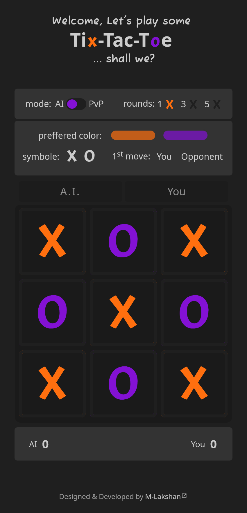

## Welcome! 👋🏼

# Sample Web Project - Tic-Tac-Toe Game

- Codepen URL: [Codepen Solution Page](https://codepen.io/m-lakshan/full/wvojjaE)
- Live Site URL: [GitHub Pages](https://m-lakshan.github.io/web_game_Tic-Tac-Toe/)

## My process

### Built with

- Semantic HTML5 markup
- Sass
- JS
- with Visual Studio Code Editor

## Author

- Frontend Mentor - [@M-lakshan](https://www.frontendmentor.io/profile/M-lakshan)
- Dev.to - [@mlakshan](https://dev.to/mlakshan)
- Linkedin - [E M Lakshan](https://www.linkedin.com/in/e-m-lakshan-190212216/)